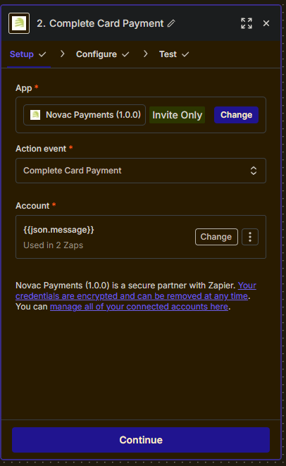

# Novac API Zapier CLI Integration

Easily automate and connect Novac payment workflows using Zapier!

---

## 🚀 Overview

This integration enables Zapier users to interact securely and efficiently with the **Novac Payment API**. You can automate payments, refunds, transfers, account creation, and more—all with Novac’s robust financial endpoints.

---

## ✨ Features

- **Create Payments:** Checkout, USSD, direct card charge, tokenized card, payment links
- **Refunds & Transfers:** Full or partial refunds, bank and account transfers
- **Virtual Accounts:** Create and retrieve virtual accounts, check balances
- **Security & Card Handling:** Encrypt/decrypt, authenticate, validate customer card details
- **Verification:** Account verification, transaction reference lookup, fee inquiry, 3DS challenges
- **Banking Operations:** Supported payout banks, account list, and utility endpoints

---

## 📂 Key Endpoints (`/creates`)

- `create_checkout_payment_link.js`
- `create_transaction_payment.js`
- `create_ussd_payment.js`
- `create_virtual_account.js`
- `initiate_refund.js`
- `initiate_partial_refund.js`
- `initiate_transfer.js`
- `direct_card_charge.js`
- `tokenized_card_charge.js`
- `validate_customer_card_details.js`
- `encrypt_customer_card_details.js`
- `decrypt_customer_card_details.js`
- _...and many more!_

---

---

## 🛠️ Getting Started

Follow these steps to set up your first Zap (workflow) using Novac Payments within Zapier:

### 1. Set up an initial Zap to catch webhooks

*Select the “Webhooks by Zapier” app and choose “Catch Hook” as the trigger event.*

---

### 2. Copy the webhook URL and add it to Novac dashboard

*Copy your custom Zapier webhook URL and paste it into the “API-settings” section on the Novac Dashboard.*

---

### 3. Continue to the first action setup and select Novac Payments

Once you click “Continue”, Zapier will prompt you to add your first action. Here, you can search over 7,000+ apps—look for **Novac Payments**.

---

### 4. Choose an action (e.g., Complete Card Payment)

*Pick an action such as “Complete Card Payment”.*

---

### 5. Use trigger data in your Novac action

You can use details from the webhook trigger—such as the transaction `reference`—as inputs to Novac for things like verifying, completing, or logging payments.

---
### 6. Add additional actions (e.g., email notifications)

You can extend your workflow with further actions—such as sending an automated email to clients if their transaction succeeds or fails.

---

**Tip:** Each step can be tailored with conditional logic, lookup tables, or additional Zapier integrations to suit your payment and notification workflow.

